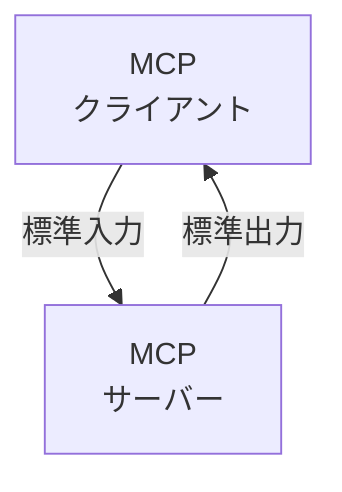
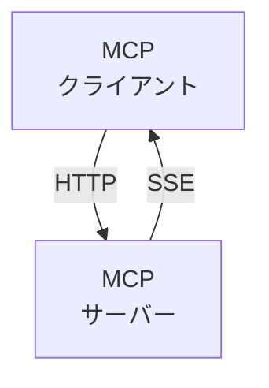
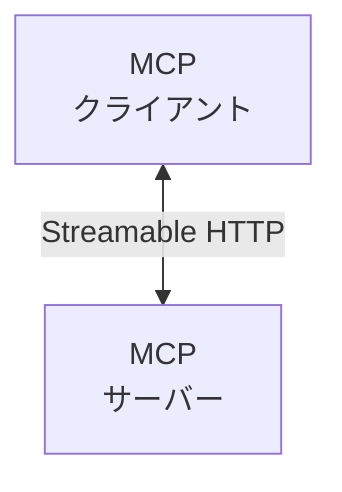

# MCP

## MCPとは

- MCPはAnthropicが2024年11月25日にオープンソースとして公開した、LLMと外部ツール／データソースを標準化して繋ぐプロトコル
- 通信はJSON-RPC 2.0をベースに設計されており、Language Server Protocol由来のしくみを活用してる
- USB-C が様々なデバイスを標準化されたインターフェースで接続できるように、MCPは生成 AI モデルと様々なデータソースやツールを標準化された方法で接続する

## クライアント・サーバモデル

----------------------------

### ローカルMCPサーバー


----------------------------------

### リモートMCPサーバー

- **旧方式**


--------------------------------------

- **新方式**


--------------------------------------

## Vs Codeでのやり方
- **1**.**F1**を押して```Open User Settings```を入力し、JSONファイルを開く。</br>
- **2**.```"geminicodeassist.updateChannel": "Insiders",```をsettings.jsonに追加
  ・(ただしなぜかjsonファイルに改行の```,```がなくなってることがあるので```:```が赤くなった場合確認)
- **3**.右下に**Reload**ってでたら押す
  ・(ただしでなかっ場合はコマンドパレットに**reload**を入力)
- **4**.GeminiCLIを起動してAgentを有効にする</br>
- **5**.その後ターミナルを入力する</br>

```
(New-ObjectZNet.WebClient).DownloadFile("https://dl.google.com/dl/cloudsdk/channels/rapid/GoogleCloudSDKInstaller.exe", "$env:Temp\GoogleCloudSDKInstaller.exe")
& $env:Temp\GoogleCloudSDKInstaller.exe
```

- **6**.その後ダウンロードが始まり設定する</br>
- **7**.コンソールが起動するので途中で```y/n```って出るので```Y```と入力後Enterを押す</br>
- **8**.ログインサイトに飛ばされるのでログインする(もし出なかった場合urlが出てるのでそれで調べる)
- **9**.押した後1~5の選択肢が出るのでを選択する</br>
  ・ [1]が既に存在するプロジェクト
  ・ [2]が別の既存プロジェクト
  ・ [3]がまた別のプロジェクト
  ・ [4]が既存のプロジェクトIDを自分で入力する選択肢
  ・ [5]が新しくプロジェクトを作成する選択肢
