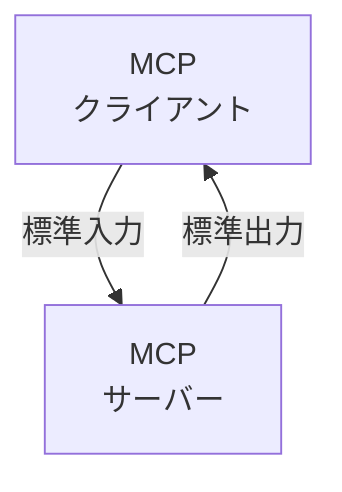
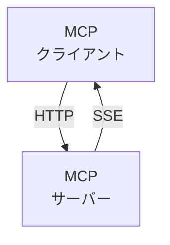
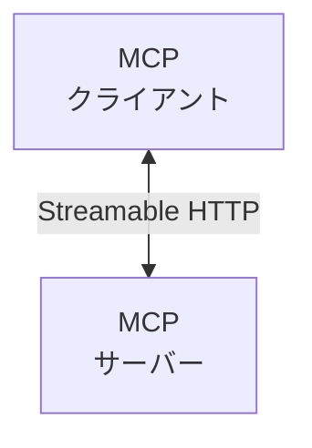

# MCP

## MCPとは

- MCPはAnthropicが2024年11月25日にオープンソースとして公開した、LLMと外部ツール／データソースを標準化して繋ぐプロトコル
- 通信はJSON-RPC 2.0をベースに設計されており、Language Server Protocol由来のしくみを活用してる
- USB-C が様々なデバイスを標準化されたインターフェースで接続できるように、MCPは生成 AI モデルと様々なデータソースやツールを標準化された方法で接続する

## クライアント・サーバモデル

### ローカルMCPサーバー

### リモートMCPサーバー

- **旧方式**

- **新方式**

## 
