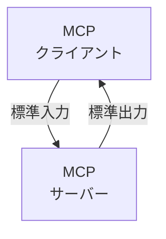
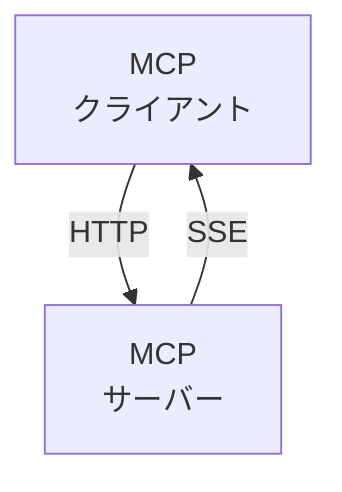
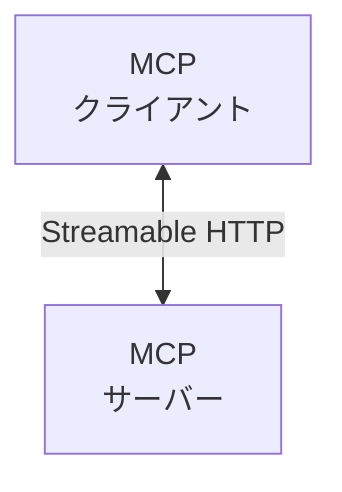

# _**MCP**_

## MCPとは

- MCPはAnthropicが2024年11月25日にオープンソースとして公開した、LLMと外部ツール／データソースを標準化して繋ぐプロトコル
- 通信はJSON-RPC 2.0をベースに設計されており、```Language Server Protocol```由来のしくみを活用してる
- USB-C が様々なデバイスを標準化されたインターフェースで接続できるように、MCPは生成 AI モデルと様々なデータソースやツールを標準化された方法で接続する

## クライアント・サーバモデル

### ローカルMCPサーバー


----------------------------------

### リモートMCPサーバー

- **旧方式**


--------------------------------------

- **新方式**


--------------------------------------

## MCP入れ方
- **1**.**F1**を押して```Open User Settings```を入力し、JSONファイルを開く。
- **2**.```"geminicodeassist.updateChannel": "Insiders",```をsettings.jsonに追加</br>
  ・(ただしなぜかjsonファイルに改行の```,```がなくなってることがあるので```:```が赤くなった場合確認)
- **3**.右下に**Reload**ってでたら押す
  ・(ただしでなかっ場合はコマンドパレットに**reload**を入力)
- **4**.GeminiCLIを起動してAgentを有効にする</br>
- **5**.その後ターミナルを入力する</br>

```
(New-ObjectZNet.WebClient).DownloadFile("https://dl.google.com/dl/cloudsdk/channels/rapid/GoogleCloudSDKInstaller.exe", "$env:Temp\GoogleCloudSDKInstaller.exe")
& $env:Temp\GoogleCloudSDKInstaller.exe
```

- **6**.その後ダウンロードが始まり設定する</br>
- **7**.コンソールが起動するので途中で```Y/n```って出るので```Y```と入力後Enterを押す</br>
- **8**.ログインサイトに飛ばされるのでログインする(もし出なかった場合URLが出てるのでそれで調べる)
- **9**.押した後1~5の選択肢が出るのでを選択する</br>
  ・ [1]が既に存在するプロジェクト</br>
  ・ [2]が別の既存プロジェクト</br>
  ・ [3]がまた別のプロジェクト</br>
  ・ [4]が既存のプロジェクトIDを自分で入力する選択肢</br>
  ・ [5]が新しくプロジェクトを作成する選択肢</br>
- **10**.プロジェクト選択後、使用するリージョンの設定を求められることがあるあめ選択する</br>
  ・```us-central1```などでたりするが特にに指定がなければデフォルトのままでEnterでも大丈夫
- **11**.```Cloud SDK```がセットアップ完了したら、以下のコマンドで```gcloud CLI```が正しく動作するか確認する</br>

```
gcloud --version
```

- **12**.Gemini Code Assistを有効化するためにAPIの有効化を行う

```
gcloud services enable aiplatform.googleapis.com
```

- **13**.Gemini Code Assist Agentを設定する

```
gcloud ai code-assist agents create --project=<PROJECT_ID> --location=us-central1
```

- **14**.VS Codeに戻り、Gemini Code Assist拡張が正常に機能しているかを確認</br>
　・ソースコードファイルを開き、右下に```Gemini Connected```などの表示があるか
- **15**. 動作確認として、コメントで「// suggest: 関数名」と入力して補完が出るかテストする

```
// suggest: calculateSum
```
- **16**.問題がある場合のトラブルシューティング</br>
  ・VS Codeの再起動</br>
　・```Google Cloud CLI```が```PATH```に正しく追加されているか確認</br>
- **17**.CLIのPATH確認（再起動後も使えるか）</br>
  ・インストール後に環境変数```PATH```に```gcloud```が入っていないと、再起動後に動かないケースがあります。（正常に情報が出ればOK）

```
gcloud info
```

----------------------------------------------

## MCP使い方

- **1**.カスタムエージェント（Agent）作成・管理</br>
  ・Geminiを使って、自分専用のAIアシスタントを作る</br>
  ・作成後は```Gemini Code Assist```から自動的に使えることもある</br>
  ・チーム用途では「組織用エージェント」も作れる</br>
```

   gcloud alpha ai agents create \
  --display-name="MyDevAgent" \
  --project=[PROJECT_ID] \
  --location=us-central1

```
- **2**.ツール（Tools）やAPIの連携</br>
  ・```Google Docs```の読み取り、```Cloud SQL```の接続、独自APIの呼び出し</br>

```
gcloud alpha ai tools create \
  --display-name="MyWeatherAPI" \
  --type="HTTP" \
  --endpoint="https://api.weatherapi.com/..." \
  --project=[PROJECT_ID]
```

- **3**.インストラクションのカスタマイズ</br>
  ・Geminiを話し方など細かく調整できる

```
gcloud alpha ai agents update [AGENT_ID] \
  --instructions-file=custom_instructions.yaml
```

- **4**.データのアップロード</br>
  ・独自ファイルをGeminiに覚えさせて、そこから回答させる
```
gcloud alpha ai data-stores create \
  --display-name="InternalDocs" \
  --project=[PROJECT_ID]

gcloud alpha ai data-items upload \
  --data-store=InternalDocs \
  --file-path=./my_company_guide.pdf

```

- **5**.VS CodeでMCPエージェントを使う</br>
  ・VS CodeのGemini拡張設定から、自分のカスタムエージェントを指定可能</br>
  ・複数のエージェントを切り替えながら開発もできる

- **6**.ダッシュボードで動作確認</br>
  ・```Vertex AI Studio```で、Agentの動作確認やGroundingドキュメントの確認などできる

- **7**.YAMLベースのFlow構築</br>
  ・```multi_step_flow.yaml```

```
steps:
  - id: generate_sql
    prompt:
      text: "ユーザーの質問からSQLクエリを生成してください: {{input}}"

  - id: run_query
    tool_call:
      tool: my_database_api
      input: "{{steps.generate_sql.output}}"

  - id: summarize_result
    prompt:
      text: "以下のデータを読みやすく要約してください:\n\n{{steps.run_query.output}}"

```

- **8**.Gemini APIを使った手動オーケストレーション</br>
  ・自前のアプリ・サーバーで「多段プロンプト処理」を実装する

```

# ステップ1: 自然言語 → コマンド生成
step1 = model.generate_content("このPCをシャットダウンするPowerShellコマンドは？")

# ステップ2: 出力をToolに送る or 再処理
step2 = model.generate_content(f"このコマンドの解説をしてください:\n{step1.text}")

```

- **9**.Toolの定義</br>
  ・Geminiが使う外部APIをツールとして登録する

```
gcloud alpha ai tools create \
  --display-name="WeatherTool" \
  --tool-id="weather_tool" \
  --type="HTTP" \
  --endpoint="https://api.weatherapi.com/v1/current.json" \
  --method="GET" \
  --parameters='[{"name": "q", "required": true, "type": "string", "description": "City name"}]' \
  --headers='{"key": "YOUR_API_KEY"}' \
  --project=[PROJECT_ID] \
  --location=us-central1

```

- **10**.GeminiエージェントにToolを紐づける

```
gcloud alpha ai agents update [AGENT_ID] \
  --add-tool="projects/[PROJECT_ID]/locations/us-central1/tools/weather_tool"
```

- **11**.Geminiから呼び出すプロンプトを書く</br>
  ・Toolを使って自動でAPIを呼び出す。

```
「愛知の現在の天気を教えてください。」
↓
→ Geminiが「weather_tool」APIを呼び出す
↓
→ 結果を受け取って、自然な文章にして返す
```

- **12**.複数モデルの切り替え</br>
  ・複数のLLMを 使い分けることが可能</br>
- **13**.CLIでモデルを指定してエージェントを作成 / 更新

```

gcloud alpha ai agents create \
  --display-name="MyGeminiAgent" \
  --model="gemini-1.5-pro" \
  --project=[PROJECT_ID] \
  --location=us-central1

```
 ・すでにある場合
```

gcloud alpha ai agents update [AGENT_ID] \
  --model="gemini-1.5-flash"

```

- **14**.API呼び出し時にモデルを指定

```

from vertexai.preview.generative_models import GenerativeModel

model = GenerativeModel("gemini-1.5-pro")  # ← モデル指定

response = model.generate_content("PythonでFizzBuzz書いて")

```

- **15**.Vertex AI Studio上でモデルを選択</br>
  ・モデルセクションで使用可能モデルを確認</br>
  ・Studioで「Gemini 1.5 Pro」や「Flash」などを選んでテスト可能</br>

- **16**.使用可能モデルを確認する方法</br>

```

gcloud ai models list --region=us-central1

```

----------------------------------------------
## 参考サイト
- [Model Context Protocol（MCP）とは？生成 AI の可能性を広げる新しい標準](https://zenn.dev/cloud_ace/articles/model-context-protocol)
- [やさしいMCP入門](https://speakerdeck.com/minorun365/yasasiimcpru-men)
- [Visual Studio Code⁠⁠、厳選したMCPサーバーの一覧ページを公開](https://gihyo.jp/article/2025/06/mcp-server-lists-for-vscode)
